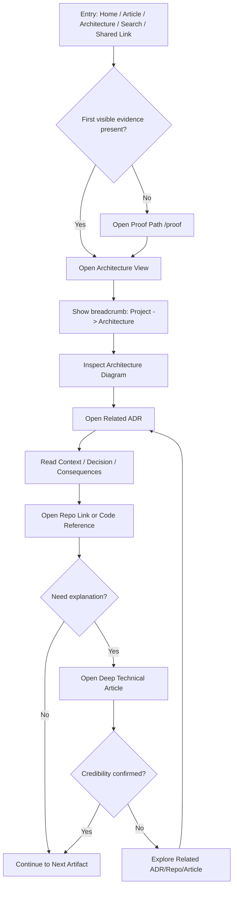
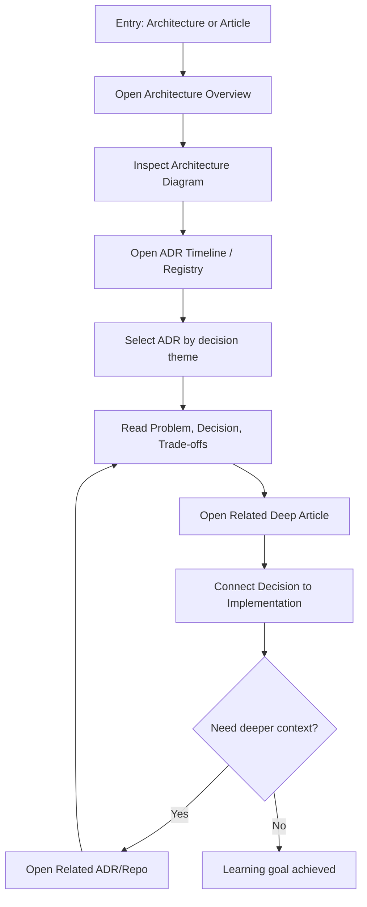
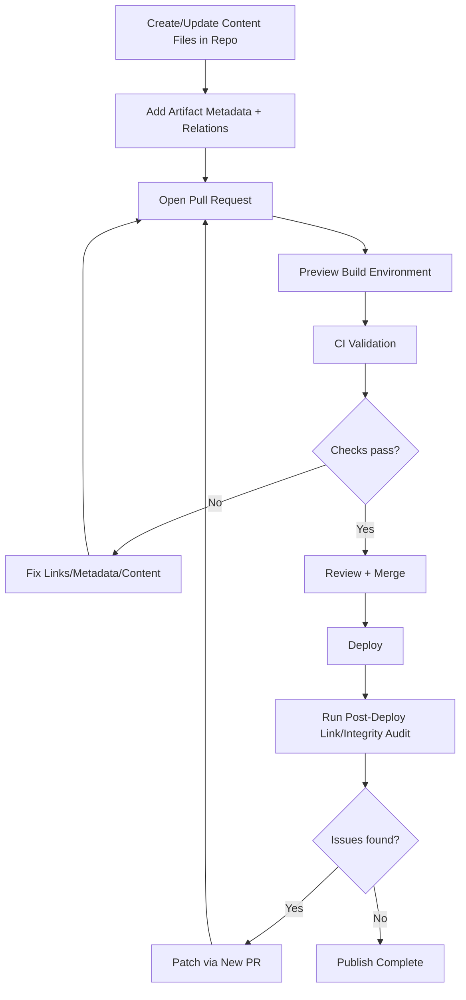

---
stepsCompleted:
  - 1
  - 2
  - 3
  - 4
  - 5
  - 6
  - 7
  - 8
  - 9
  - 10
  - 11
  - 12
  - 13
  - 14
lastStep: 14
inputDocuments:
  - _bmad-output/planning-artifacts/prd.md
  - _bmad-output/planning-artifacts/prd-validation-report.md
---

# UX Design Specification blog

**Author:** Yorran
**Date:** 2026-03-08 11:55:19

---

<!-- UX design content will be appended sequentially through collaborative workflow steps -->
## Executive Summary

### Project Vision

Blog is a public engineering evidence platform where technical credibility is validated through traceable artifacts, not narrative-only content.  
The core UX goal is to let an advanced technical visitor verify engineering depth in minutes through a clear chain: Architecture -> ADR -> Repository/Code -> Deep Technical Article.

### Target Users

Primary users are advanced technical practitioners:
- Backend engineers
- Staff engineers
- Tech leads
- Senior developers

Secondary users are:
- Technical recruiters performing engineering screening
- Engineers studying system design

Usage context is mostly desktop-first for long-form reading, code/diagram analysis, and artifact traversal, with mobile as a secondary context for quick scanning and proof-path exploration.

### Key Design Challenges

- Surface credible engineering signals within the first screen without requiring deep reading.
- Preserving traceability clarity across artifacts: decision rationale and implementation proof must stay connected and discoverable.
- Avoiding content isolation: each page must prevent dead ends and expose meaningful next technical steps.
- Balancing depth with navigation speed: advanced users need dense content, but with low-friction movement between architecture, ADRs, and code.
- Supporting desktop-heavy analytical flows while still enabling mobile proof-path snapshots.

### Design Opportunities

- A purpose-built proof-path UX can become a strong differentiator versus traditional engineering blogs.
- Artifact-first information architecture can transform portfolio perception from “content site” to “engineering evidence system.”
- Graph-like artifact navigation can turn the platform into a browsable engineering knowledge system rather than a chronological blog.
- Context-rich cross-linking (Architecture, ADR, Repo, Deep Article) can create a reusable credibility pattern across projects.
- Advanced-reader-oriented interaction patterns (quick evidence jumps, relationship panels, breadcrumbed chains) can improve trust and time-to-validation.
- Mobile “quick proof scan” flows can extend reach for recruiters without diluting technical rigor.
## Core User Experience

### Defining Experience

The core user action is navigating connected technical artifacts to validate engineering credibility, not consuming isolated posts.  
The dominant flow is: Home -> Architecture -> ADR -> Repo/Code -> Deep Article.  
The product succeeds when users can verify real system thinking through evidence links in minutes, with the Proof Path as the primary credibility mechanism.

### Platform Strategy

The platform is web-only, implemented as static-first MPA with Astro.  
Primary interaction context is desktop with mouse/keyboard for long-form technical reading, architecture analysis, and artifact traversal.  
Mobile is secondary and optimized for quick proof-path scanning.  
No offline capability is required for MVP.

### Effortless Interactions

Critical zero-friction interactions are:
- Open architecture view in under 1 second, with immediate visibility of diagram, components, and services.
- Open ADR pages with instant comprehension of Context, Decision, Consequences, and Links.
- Jump directly to implementation evidence via repo/directory/commit links without intermediate friction.
- Traverse artifact chain without dead ends or unclear navigation transitions.

### Critical Success Moments

The make-or-break moment happens in the first 10-15 seconds when a visitor asks: "prove it."  
Users must quickly see concrete engineering signals: architecture diagram, real decisions, and real repository evidence.  
The critical chain is: Home -> Architecture -> ADR -> Repo.  
If any step fails (broken link, shallow content, or confusing navigation), technical credibility drops immediately.

### Experience Principles

- Proof-path first: prioritize rapid evidence validation over narrative browsing.
- Artifact navigation is the primary interface, not chronological content browsing.
- First-screen credibility: show concrete engineering signals immediately.
- Zero-friction evidence jumps between architecture, decisions, and code.
- Depth with speed: advanced users get dense technical context without navigation overhead.
- Reliability as UX: link integrity and content depth are non-negotiable trust factors.
## Desired Emotional Response

### Primary Emotional Goals

The primary emotional goal is technical trust: users should feel they are seeing real engineering, not generic technical content.  
The product should communicate credibility through verifiable artifacts and clear evidence chains, not opinion-heavy narrative.

### Emotional Journey Mapping

- First 10-15 seconds: users should feel immediate interest and trust ("this looks serious"), driven by visible architecture, ADR, and real repository signals.
- During the proof-path: users should feel progressive clarity, where each step answers a specific question:
  - Architecture -> how the system works
  - ADR -> why decisions were made
  - Repo -> how it was implemented
- After completing the flow: users should feel credibility confirmed ("this engineer truly designs systems").
- If failures occur (broken links, missing artifacts): users should still feel transparency and control through clear explanation and guided alternatives.

### Micro-Emotions

Critical micro-emotions to reinforce:
- Confidence over confusion
- Trust over skepticism
- Momentum over friction
- Professional respect over dismissal
- Technical curiosity over passive consumption

### Design Implications

- Technical trust -> prioritize evidence visibility above the fold (architecture diagram, ADR entry points, repo links).
- Clarity -> enforce structured artifact pages and explicit navigation labels.
- Curiosity -> create low-friction transitions between related artifacts with clear “next evidence” actions.
- Professional respect -> maintain high signal density, objective language, and technical depth.
- Transparency in failure -> replace dead-end errors with explicit status, context, and alternative navigation paths.

### Emotional Design Principles

- Credibility first: design must prove, not claim.
- Clarity under pressure: users should understand value in seconds.
- Progressive sensemaking: each interaction should reduce uncertainty.
- Friction is trust debt: every unnecessary step weakens credibility.
- Transparent recovery: when evidence is unavailable, explain clearly and preserve user confidence.
## UX Pattern Analysis & Inspiration

### Inspiring Products Analysis

#### Stripe Docs

Stripe Docs is a strong reference for technical information architecture and navigation clarity.

What works well:
- Persistent, contextual sidebar navigation that keeps users oriented.
- Clear hierarchical structure with predictable content progression.
- Scannable technical content with emphasized code/examples and fast in-page movement.

Relevant lesson for this product:
- Use sticky contextual navigation and predictable section structure to reduce cognitive load for advanced users.

Risk to avoid:
- Excessive text before actionable evidence. For this product, architecture signals must appear before long narrative blocks.

#### Cloudflare Engineering Blog

Cloudflare Engineering is a strong reference for technical storytelling anchored in real systems.

What works well:
- Articles are connected to broader technical context instead of being isolated.
- Diagram-first communication with progressive explanation.
- Structured technical flow (problem -> solution -> trade-offs).

Relevant lesson for this product:
- Lead with visual/system evidence, then explain decisions and consequences.

Risk to avoid:
- Very long narrative sections without enough visual checkpoints. This product should enforce decision blocks and artifact link checkpoints.

#### GitHub

GitHub is a strong reference for context preservation and low-friction technical navigation.

What works well:
- Persistent context visibility (repo, branch, commit, path).
- Clear structure + content + metadata framing.
- Fast interaction model with minimal navigation friction.

Relevant lesson for this product:
- Preserve user orientation at all times through breadcrumbs, context panels, and visible metadata.

Risk to avoid:
- Overly dense interface for less technical users. This product must keep high technical signal while preserving clarity.

### Transferable UX Patterns

#### Navigation Patterns

- Stripe-style contextual sidebar for section orientation and fast movement across artifact hubs.
- GitHub-style breadcrumb navigation to preserve chain context (Project -> Architecture -> ADR -> Repo -> Article).
- Mandatory related-artifact panel on every artifact page to prevent dead ends.

#### Information Hierarchy Patterns

- Diagram-first page strategy for architecture and system understanding.
- Progressive structure for technical content:
  - Diagram / context
  - Decision or problem framing
  - Evidence link(s)
  - Deep explanation
- Visible metadata blocks (artifact type, date, linkage, related chain) to reinforce trust and orientation.

#### Interaction Patterns

- Quick jumps between artifacts as primary interaction model.
- “Next evidence” actions that keep proof-path momentum.
- Structured decision blocks for fast technical scanning and validation.

### Anti-Patterns to Avoid

- Chronological blog-first experience (“latest posts”) as primary navigation model.
- Isolated pages without explicit related artifact links.
- Marketing-heavy tone, buzzword content, or claims without verifiable evidence.
- Long uninterrupted text without diagram/checkpoint anchors.
- Friction-heavy transitions that require excessive clicks to reach code-level proof.

### Design Inspiration Strategy

#### What to Adopt

- Sticky contextual navigation (Stripe Docs) for orientation and fast traversal.
- Diagram-first, problem-to-solution technical flow (Cloudflare Engineering).
- Breadcrumbs, context framing, and visible metadata (GitHub).
- Artifact-driven navigation as the product’s primary interaction paradigm.

#### What to Adapt

- Reduce narrative lead-in and surface engineering proof in the first screen.
- Keep GitHub-like context density but with stricter readability and visual clarity.
- Use Cloudflare-style depth with explicit artifact checkpoints and proof links.

#### What to Avoid

- Blog chronology as default UX structure.
- Any page state where users cannot move directly to the next evidence artifact.
- Design or copy choices that prioritize persuasion over verification.
## Design System Foundation

### 1.1 Design System Choice

The project will use a custom design system built on top of Tailwind as the styling foundation.  
This approach prioritizes a balanced strategy with a deliberate tilt toward visual uniqueness, ensuring the product feels serious, technically credible, and non-generic while preserving implementation speed for MVP.

### Rationale for Selection

- The product’s core value is technical credibility, so visual language must communicate rigor, clarity, and trust from first contact.
- Off-the-shelf component aesthetics (e.g., heavy default UI kits) risk making the experience feel generic and reducing differentiation.
- A custom token-driven system provides stronger control over hierarchy, readability, and artifact-focused information architecture.
- Tailwind offers fast, reliable implementation while still allowing a distinct identity when paired with custom tokens and components.
- Given medium implementation capacity for MVP, this approach is feasible without overcommitting to a full enterprise-grade design system build.

### Implementation Approach

- Use Tailwind as low-level styling infrastructure (layout, spacing, responsive behavior, utility composition).
- Define a first-class design token layer (color roles, typography scale, spacing, radius, shadows, borders, motion timing).
- Build a focused custom component set for MVP-critical surfaces:
  - Artifact cards
  - Proof-path navigation blocks
  - Context panels
  - Decision blocks (ADR-focused)
  - Metadata rows
  - Related-artifact link modules
- Enforce page-level composition patterns aligned with artifact-first navigation and diagram-first hierarchy.
- Prioritize desktop analytical readability while maintaining functional mobile proof-path flows.

### Customization Strategy

- Start from zero with a clear visual direction: serious, sophisticated, technical, high-information-density, and highly legible.
- Establish strict hierarchy rules for technical reading:
  - Immediate evidence visibility above the fold
  - Strong heading and section rhythm
  - Distinct treatment for architecture/ADR/repo/article artifacts
- Create a constrained token system to keep consistency and avoid ad-hoc styling drift.
- Encode trust through interaction quality:
  - Predictable navigation states
  - Clear focus/hover behavior
  - Error transparency patterns
- Keep component scope intentionally lean in MVP, expanding only where it improves proof-path clarity or artifact discoverability.
## 2. Core User Experience

### 2.1 Defining Experience

The defining experience is enabling users to understand architecture, decision rationale, and real implementation evidence in a few minutes through connected technical artifacts.  
Users should describe the product as "navigating the engineering of a system," not simply reading blog posts.

### 2.2 User Mental Model

Users currently validate technical depth through fragmented sources:
Blog post -> GitHub -> README -> issues -> code.

This process creates major friction:
- Missing architectural context
- Undocumented decision rationale
- Fragmented information across disconnected channels

Users expect a coherent technical path where architecture, decisions, implementation, and explanation are explicitly linked.

### 2.3 Success Criteria

The core experience is successful when:
- Users understand the system architecture quickly from immediate visual/system signals (diagram, components, services).
- Navigation progression feels natural and self-evident:
  Architecture -> ADR -> Repo -> Article.
- Users can reach verifiable implementation proof (repo, directory, code evidence) without searching friction.

### 2.4 Novel UX Patterns

The interaction model is primarily established (about 80%), grounded in familiar patterns from documentation systems, engineering blogs, and GitHub-style navigation.  
Innovation comes from artifact-chain navigation as a first-class pattern:
Decision -> Architecture -> Implementation, with explicit traceability between every step.

This approach minimizes onboarding cost while creating a differentiated credibility experience.

### 2.5 Experience Mechanics

**1. Initiation**
- Entry points include Home, Project pages, Architecture pages, and deep-linked Articles (SEO/shared links).
- The interface immediately surfaces engineering evidence entry points rather than narrative-first content.

**2. Interaction**
- Users explore architecture (diagram, components, service relationships).
- Users open ADRs to understand problem, decision, and trade-offs.
- Users jump to implementation evidence (repo, directory, code references).
- Users consume deep technical explanation linked to the same artifact chain.

**3. Feedback**
- Breadcrumb context remains visible (Project -> Architecture -> ADR).
- Related artifact modules continuously show next valid technical steps.
- Context panels keep critical state visible (project, decision context, artifact type).

**4. Completion**
- Users feel complete when they understand system structure, decision rationale, and real code evidence.
- The expected post-completion behavior is continued exploration:
  another ADR, another project, another article, or direct repo navigation.
## Visual Design Foundation

### Color System

The visual system starts from a custom palette designed for engineering credibility and technical depth, with no dependency on pre-existing brand guidelines.

**Core Foundation (Dark Neutral Base):**
- Charcoal/graphite foundation:
  - `#0B0D10`
  - `#111418`
  - `#171B21`

**Primary Interactive Color:**
- Deep indigo / cold blue:
  - `#4C6FFF`
  - `#5B7CFF`
- Usage is intentionally restrained and semantic:
  - Primary links
  - Keyboard focus emphasis
  - Active artifact states

**Technical Accent Color:**
- Cyan accent:
  - `#22D3EE`
- Usage:
  - Diagram highlights
  - Technical status indicators
  - Positive/system-healthy signals

**Color Usage Principles:**
- Prioritize neutral authority over visual noise.
- Avoid generic SaaS blue dominance, purple dev-blog aesthetics, and decorative gradients.
- Preserve high contrast and clear semantic mapping for trust-critical flows.

### Typography System

The typography strategy uses a dual-family system: Sans + Mono.

**Sans (UI + long-form technical reading):**
- Preferred options: Inter, Manrope, or Geist
- Role:
  - Core interface text
  - Long-form article reading
  - Heading hierarchy and navigation labels

**Mono (code + technical references):**
- Preferred options: JetBrains Mono or IBM Plex Mono
- Role:
  - Code blocks
  - IDs and artifact metadata
  - ADR references
  - Technical metrics and structured values

**Typography Principles:**
- Strong hierarchy for fast scanning (title -> section -> artifact metadata -> body).
- Reading-first line length and spacing tuned for technical depth.
- Distinct visual identity between explanatory prose and implementation evidence.

### Spacing & Layout Foundation

The layout model is editorial-technical with medium density: breathable but high signal.

**Spacing System:**
- 8px base scale:
  - 8, 16, 24, 32, 48, 64
- Applied consistently across component padding, section rhythm, and layout gaps.

**Grid System:**
- Desktop-first 12-column grid.
- Recommended default structure for artifact-heavy pages:
  - 2 columns: contextual/sidebar navigation
  - 7 columns: main technical content
  - 3 columns: related artifacts/context panel
- Simplified pages can use centered ~8-column content width.

**Layout Principles:**
- Keep orientation persistent (navigation + context visible).
- Optimize for architecture/ADR/article traversal with minimal cognitive switching.
- Maintain responsive integrity for mobile proof-path scanning without losing structural clarity.

### Accessibility Considerations

Visual foundation is explicitly aligned with WCAG 2.2 AA baseline.

**Accessibility Rules:**
- Minimum text contrast target: 4.5:1 where applicable.
- Always-visible, high-salience focus states (never remove focus rings).
- Links must be visually identifiable as links (not color-only ambiguity in context).
- Typography, spacing, and color choices must preserve readability across long technical sessions.
- Interaction states (hover/focus/active/error) should remain semantically clear and consistent across artifacts.
## Design Direction Decision

### Design Directions Explored

Eight visual directions were explored through the HTML showcase, with focus on artifact-first navigation, technical credibility, and proof-path clarity.

Primary evaluation dimensions:
- Information hierarchy clarity
- Navigation context preservation
- Visual density for technical reading
- Fit with trust-first emotional goals

Directions 03 (Graph Console) and 06 (Context Matrix) were explicitly deprioritized as base approaches due to excessive tool-like density and reduced reading comfort.

### Chosen Direction

The selected direction is a hybrid:

- **Base Layout:** Direction 01 - Evidenced Minimal
- **Navigation Pattern:** Direction 04 - Breadcrumb First
- **Proof Onboarding Flow:** Direction 08 - Guided Proof Path (for `/proof`)

Target structural model:
- Sidebar navigation
- Main artifact content area
- Persistent related-artifacts context panel
- Persistent breadcrumb chain (`Project -> Architecture -> ADR -> Repo`)

### Design Rationale

This hybrid best satisfies the product’s core UX thesis: rapid technical credibility validation through connected artifacts.

Why this direction:
- Preserves clarity while maintaining technical depth
- Reinforces context awareness for advanced users
- Keeps artifact traversal explicit and low-friction
- Supports first-time visitors via guided proof progression
- Communicates a serious engineering system, not a personal chronological blog

Mandatory refinements before lock-in:
- Diagram-first hero on Home/Architecture entry
- Standardized artifact cards (ADR/Repo/Article with type, status, related links)
- Always-visible related-artifacts pathway to prevent dead ends

### Implementation Approach

- Use Direction 01 as canonical page composition baseline.
- Apply Direction 04 breadcrumb behavior globally on artifact pages.
- Implement Direction 08 stepped experience for `/proof` onboarding.
- Define reusable components:
  - `ArtifactCard`
  - `BreadcrumbChain`
  - `RelatedArtifactsPanel`
  - `ProofStepNavigator`
  - `DiagramHero`
- Enforce a rule: every artifact page must expose at least one explicit next-step path in the evidence chain.
## User Journey Flows

### Technical Visitor - Credibility Validation Path

Goal: validate engineering credibility quickly through connected artifacts.

Key error recovery:
- If link is broken/missing, show transparent fallback with alternatives (`related artifacts`, `/proof`, parent breadcrumb).

### Learning Engineer - Architecture Learning Path

Goal: understand system design and trade-offs progressively.

Optimization:
- progressive disclosure (diagram first, then rationale, then implementation detail).

### Author/Maintainer - Publish and Integrity Path (Repo Workflow MVP)

Goal: publish artifact-linked content with structural integrity.

Required CI checks:
- schema/metadata validity
- relation integrity (no orphan/dead-end artifacts)
- broken link checks
- SEO/accessibility baseline checks (where applicable)
- i18n pairing validation (EN <-> pt-BR)

### Journey Patterns

Common reusable patterns across flows:
- Entry-agnostic start
- Persistent context (breadcrumb + artifact metadata visible)
- Evidence-first progression (architecture -> decision -> implementation -> explanation)
- Guided recovery for broken/missing artifacts
- Related-artifact continuity on every page
- Artifact context visibility (always show Project / ADR / Repo / Article clearly)

### Flow Optimization Principles

- Minimize steps to first evidence signal.
- Keep decision points explicit and low cognitive load.
- Preserve momentum with “next evidence” actions.
- Never allow dead-end pages.
- Treat transparency on failure as trust-preserving UX behavior.
- Favor familiar patterns and innovate at artifact-chain level.
- Always surface artifact type and context clearly.
## UX Consistency Patterns

### Button Hierarchy

Use only 3 action levels to keep interaction predictable and low-noise.

**Primary (proof actions):**
- Open Architecture
- Start Proof Path
- View ADR

**Secondary (navigation/context):**
- Back to Project
- View Related Artifacts
- Open ADR Registry / Architecture Index

**Tertiary (inline links):**
- Inline technical references in body text
- Cross-links to related artifacts in paragraphs/lists

Rules:
- One primary action per viewport section.
- Secondary actions must never visually compete with primary proof actions.
- Tertiary links must remain clearly link-like (color + underline treatment).

### Navigation Patterns

Navigation consistency is mandatory across all artifact pages.

**Persistent patterns:**
- `BreadcrumbChain`: `Project -> Architecture -> ADR -> Repo` (or closest valid chain)
- `Sidebar Navigation`: Projects, Architecture, ADRs, Articles
- `RelatedArtifactsPanel`: related ADRs, repos, articles
- `ProofStepNavigator`: only on `/proof` journey pages

Golden rule:
- `BreadcrumbChain` + `RelatedArtifactsPanel` must appear on every artifact page.

### Artifact Context Patterns

Every artifact page starts with a standardized `ArtifactContextHeader`.

Required context fields:
- Artifact type
- Artifact ID
- Project
- Status
- Related artifacts summary

Example:
- `ADR-014`
- `Idempotency Strategy`
- `Project: Payment Platform`
- `Status: Accepted`

Purpose:
- eliminate context ambiguity
- reinforce technical orientation immediately
- reduce cognitive load when entering via deep links

### Evidence Progression

Core platform progression must always be visible:
- `Architecture -> ADR -> Repo -> Article`

Rule:
- Every artifact page must present at least one explicit “next evidence” action.

Implementation expectations:
- “Next evidence” CTA inside main content
- mirrored next-step option in `RelatedArtifactsPanel`
- fallback next-step when primary target is unavailable

### Feedback Patterns

Feedback must preserve trust and momentum, especially in degraded states.

**Missing artifact:**
- Message: “Artifact unavailable.”
- Action: “View related artifacts instead.”

**Broken implementation link:**
- Message: “Implementation reference unavailable.”
- Actions: “Open related ADR” / “Open related article.”

**Success validation:**
- Message: “Evidence verified.”
- Optional state badge: `validated`

Rules:
- Explain what happened
- explain impact
- always provide a clear next action

### Empty / Loading / Error States

Primary rule:
- Never allow dead-end pages.

**Empty state:**
- “No related artifacts found.”
- CTA: “Explore Architecture” / “Open ADR Registry”

**Error state:**
- “Artifact reference unavailable.”
- CTA: “Navigate via breadcrumb” / “Open related artifacts”

**Loading state (minimal in static-first):**
- Use only where needed (diagram viewer, search, filter updates)
- Prefer skeletons for known structures
- avoid full-screen blocking loaders

### Form Patterns

MVP scope is minimal: search and lightweight filters only.

Guidelines:
- minimal fields
- clear placeholder text
- immediate, readable results
- keyboard-first usability
- no complex multi-step forms in MVP
## Component Strategy

### Design System Components

The project uses Tailwind + custom tokens with a lean foundation component set aligned to a static-first reading system.

**Foundation components for MVP:**
- `Button`
- `Link`
- `Badge`
- `Alert`
- `Tabs`
- `Table`
- `Tooltip` (optional in MVP)

**Deferred foundation components (post-MVP unless proven necessary):**
- `Input`
- `Select`
- `Accordion`
- `Dialog`
- `Pagination`

Rationale:
The MVP is not form-heavy and has no admin CRUD interface. The primary interaction model is technical reading and artifact traversal.

### Custom Components

#### `ArtifactContextHeader`
**Purpose:** Persistent context awareness on artifact pages.  
**Usage:** Top section of ADR/Article/Project/Architecture pages.  
**Anatomy:** Artifact ID, title, project link, status, key metadata.  
**States:** default, compact, sticky, loading fallback.  
**Accessibility:** semantic heading structure, landmark-friendly grouping, keyboard-focusable links.

#### `ArtifactCardBase`
**Purpose:** Shared visual and structural base for artifact card family.  
**Usage:** Lists, related artifacts panels, proof-path transitions.  
**Anatomy:** type badge, title, summary, metadata row, primary action.  
**States:** default, hover, active, disabled, missing-link warning.  
**Variants:** density variants (`compact`, `default`).

#### `AdrCard`
**Purpose:** Surface ADR decision summaries with traceability context.  
**Metadata:** decision ID, status, date, related implementation links.

#### `RepoCard`
**Purpose:** Surface implementation evidence and repo entry points.  
**Metadata:** repository, language, path/commit links, implementation scope.

#### `ArticleCard`
**Purpose:** Surface explanatory technical narratives linked to artifacts.  
**Metadata:** reading time, topics, linked artifacts, publication/update date.

#### `ProjectCard`
**Purpose:** Entry point to project-level architecture and artifact graph.  
**Metadata:** project scope, architecture version, number of linked artifacts.

#### `BreadcrumbChain`
**Purpose:** Persistent chain context (`Project -> Architecture -> ADR -> Repo`).  
**States:** full, truncated, mobile-collapsed.  
**Accessibility:** ordered navigation semantics and clear current-page indicator.

#### `ProofStepNavigator`
**Purpose:** Guided proof-path progression on `/proof`.  
**States:** step pending, current, complete, blocked.  
**Accessibility:** step labels, progress semantics, keyboard navigability.

#### `RelatedArtifactsPanel`
**Purpose:** Prevent dead-end pages with explicit next evidence paths.  
**Content:** related ADRs, repos, articles, projects.  
**States:** populated, sparse, empty-with-fallback actions.

#### `DecisionBlock`
**Purpose:** Standardized ADR reading structure.  
**Sections:** Context, Decision, Consequences, Links.  
**States:** default, collapsed references, warning when related evidence missing.

#### `ArtifactMetaRow`
**Purpose:** Consistent metadata display across artifact surfaces.  
**Content:** type, status, dates, language pairing, integrity markers.

#### `IntegrityStatusBanner`
**Purpose:** Transparent recovery UX for missing/broken artifact links.  
**States:** info, warning, degraded, recovered.  
**Behavior:** clear issue explanation + actionable fallback links.

### Component Implementation Strategy

- Keep a strict split between foundational UI and artifact-domain components.
- Build all custom components on tokenized Tailwind primitives to preserve consistency.
- Use `ArtifactCardBase` as compositional root and implement specialized variants (`AdrCard`, `RepoCard`, `ArticleCard`, `ProjectCard`) to avoid branching-heavy monoliths.
- Enforce context visibility by default through `ArtifactContextHeader`, `BreadcrumbChain`, and `ArtifactMetaRow`.
- Require explicit error/empty states in all navigation-critical components.
- Ensure WCAG 2.2 AA behavior (focus, semantics, contrast, keyboard paths) in every reusable component.

### Implementation Roadmap

**Phase 1 - Core MVP flow components**
- `BreadcrumbChain`
- `ArtifactContextHeader`
- `ArtifactCardBase` + (`AdrCard`, `RepoCard`, `ArticleCard`, `ProjectCard`)
- `RelatedArtifactsPanel`
- `ProofStepNavigator`
- `DecisionBlock`

**Phase 2 - Integrity and operational UX**
- `ArtifactMetaRow`
- `IntegrityStatusBanner`
- advanced empty/error/fallback states across artifact pages

**Phase 3 - Refinement and acceleration**
- visual refinements and motion polish
- navigation shortcuts for advanced users
- density variants and responsive micro-optimizations
## Responsive Design & Accessibility

### Responsive Strategy

The experience is desktop-priority with mobile-resilient adaptation.

**Desktop (primary):**
- 12-column layout with persistent technical context:
  - sidebar navigation
  - main artifact content
  - related artifacts panel
- Recommended width targets:
  - Sidebar: `240-280px`
  - Main content: `680-760px`
  - Related panel: `260-320px`
- Main content should target `~65-75ch` for long-form technical readability.
- Diagram-first and metadata-rich views remain visible without excessive scrolling.

**Tablet (adaptive, reading-first):**
- Prioritize a single reading column with progressive context:
  - main content first
  - related artifacts as collapsible section below
- Sidebar becomes toggleable/off-canvas.
- Avoid fixed dual-column dependence for core reading flows.
- Preserve breadcrumb + next-evidence actions at all times.

**Mobile (secondary but complete):**
- Single-column reading flow.
- Sticky compact context with collapsed breadcrumb (max 1 level visible), expandable on tap.
- Example compact breadcrumb: `Payment Platform / ADR-014`
- Related artifacts shown as stacked cards after core content and repeated at page end.
- `/proof` uses explicit step progression with large touch-friendly targets.

### Breakpoint Strategy

Use standard breakpoints tuned to artifact flows:

- Mobile: `320px - 767px`
- Tablet: `768px - 1023px`
- Desktop: `1024px+`
- Large desktop: `1280px+`
- Ultra-wide enhancement: `1536px+` (wider diagram area, expanded related panel)

Approach:
- Mobile-first CSS implementation
- Desktop-priority layout intent
- Component-level responsiveness (not only page-level breakpoints)

### Accessibility Strategy

Target compliance: **WCAG 2.2 AA**.

Core requirements:
- Contrast >= `4.5:1` for normal text
- Fully keyboard-operable navigation and interaction
- Visible, persistent focus indicators (never removed)
- Semantic structure with proper landmarks and heading hierarchy
- Screen-reader meaningful labels for artifact navigation and state
- Minimum touch target size around `44x44px` where applicable
- Link affordance must remain explicit (not color-only ambiguity)

Additional mandatory rules:
- `Skip to main content` link at top of page
- Code blocks must support horizontal scrolling without layout breakage
- All architecture diagrams must include text description/summary fallback

### Testing Strategy

**Responsive testing:**
- Real device checks for iOS/Android phones and tablets
- Browser matrix: Chrome, Firefox, Safari, Edge
- Verify layout integrity on proof path and artifact pages at each breakpoint

**Accessibility testing:**
- Automated checks (axe/Lighthouse/linters)
- Keyboard-only walkthrough for all critical journeys
- Screen reader smoke tests (NVDA/VoiceOver)
- Contrast and focus-state audits
- Validation of degraded states (missing/broken artifact links)

**Product-specific validation:**
- Proof-path validation test:
  - ensure the full proof path is completable without dead ends on all breakpoints
- i18n pairing checks (EN <-> pt-BR)

### Implementation Guidelines

- Build responsive behavior into each core component (`ArtifactContextHeader`, `BreadcrumbChain`, `RelatedArtifactsPanel`, `ProofStepNavigator`).
- Use semantic HTML first; apply ARIA only when semantics are insufficient.
- Keep context visibility persistent across breakpoints (never hide both breadcrumb and related-artifacts pathways).
- Prefer progressive disclosure on small screens rather than removing critical evidence context.
- Keep loading UI minimal (static-first), using skeletons only for dynamic zones (diagram viewer/search/filter).
- Treat error/empty states as recovery surfaces, not terminal states.
- Avoid hydrating components unless interaction is strictly required.

### Typography Responsiveness

- Body text should scale between `16px` and `18px` depending on viewport.
- Line length and line-height must adapt to preserve comfortable long-form reading.
- Maintain typographic hierarchy clarity across all breakpoints.